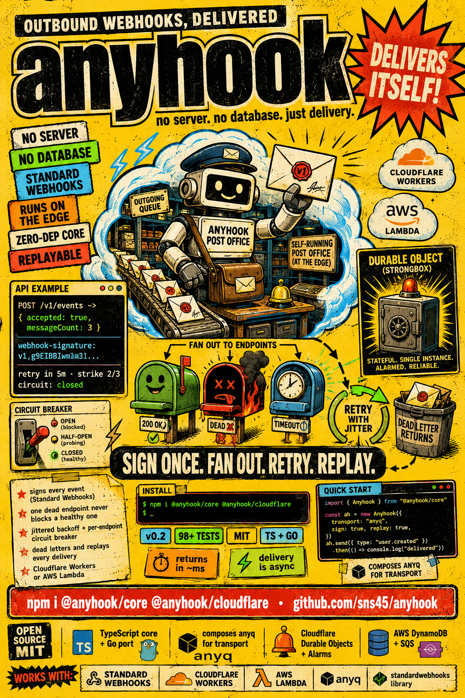

# anyhook

<p align="center">
  
</p>

**Edge-native, open-source outbound webhook delivery engine.** Your product emits a business event once; anyhook signs it ([Standard Webhooks](https://www.standardwebhooks.com)), fans it out to every subscribed customer endpoint, retries transient failures with jittered backoff, circuit-breaks dead endpoints, dead-letters exhausted deliveries, and exposes a delivery log + replay surface — with **no server to operate and no database to provision**.

It runs where your code already runs: **Cloudflare Workers** (Durable Objects + Queues) or **AWS Lambda** (SQS + DynamoDB). The engine is runtime-agnostic; the runtime is a thin adapter.

anyhook is the outbound-events sibling in a small toolkit:

- **auth-gateway** — requests coming *in* (authentication)
- **anyq** — async work *within* the system (queue abstraction)
- **anyhook** — events going *out* (customer-facing webhook delivery)

anyhook is the first flagship consumer of [anyq](https://github.com/sns45/anyq): it composes an anyq transport rather than reimplementing queueing, which is how it gets multi-runtime portability nearly for free.

## Why

Every product with an API eventually needs to *send* webhooks, and every team rediscovers that reliable outbound delivery is a distributed-systems problem: at-least-once delivery, exponential backoff with jitter, per-endpoint circuit breaking, idempotency, signature schemes, dead-letter queues, and replay. The existing open-source options are long-running servers that need Postgres + Redis/a broker. anyhook fills the gap: a library + thin runtime that installs as a Worker or a Lambda.

## Packages

| Package | Responsibility | Runtime deps |
|---|---|---|
| `@anyhook/core` | Engine: ports, retry/circuit/DLQ state machine, fan-out, portal handlers, HTTP router | **none** (zero runtime-SDK deps) |
| `@anyhook/signing` | Standard Webhooks sign/verify primitives (usable standalone) | none |
| `@anyhook/cloudflare` | CF adapter: `@anyq/cloudflare-queues` transport + Durable Object state + Alarms scheduler + deployable Worker | `@anyhook/core`, `@anyq/cloudflare-queues` |
| `@anyhook/aws` | AWS adapter: `@anyq/sqs` transport + DynamoDB state + `due_at`-GSI scheduler + Lambda handlers | `@anyhook/core`, `@anyq/sqs`, `@aws-sdk/*` |
| `@anyhook/testing` | In-memory transport/state/scheduler + a scriptable `MockReceiver` for tests | `@anyhook/core` |

A Go port (`github.com/sns45/anyhook/go`) mirrors the core engine + signing + testing, with byte-identical Standard Webhooks output.

## Quick start (Cloudflare)

```bash
npm i @anyhook/core @anyhook/cloudflare
```

Deploy the Worker template (`packages/cloudflare/wrangler.toml`), which binds two Durable Object classes + a delivery Queue and needs no database. Then:

```bash
# register a customer endpoint (secret returned once)
curl -XPOST https://your-worker/v1/endpoints \
  -H 'x-anyhook-tenant: acme' \
  -d '{"url":"https://customer.example.com/hook","eventTypes":["payment.*"]}'

# emit an event (accepted async — never blocks on delivery)
curl -XPOST https://your-worker/v1/events \
  -H 'x-anyhook-tenant: acme' \
  -d '{"type":"payment.succeeded","payload":{"amount":4200}}'
```

anyhook signs, fans out, delivers with retries + circuit breaking, and records every attempt. Query the delivery log at `GET /v1/deliveries` and replay with `POST /v1/deliveries/:id/replay`.

The producer API in code:

```ts
const receipt = await engine.send({
  type: 'payment.succeeded',
  tenant: 'acme',
  payload: { paymentId, amount },
});
// { eventId, accepted: true, messageCount }  — returns at durable acceptance, not delivery
```

## Architecture

```
   send() ─▶ @anyhook/core  (runtime-agnostic engine)
             • ingest / idempotency / fan-out
             • signing (Standard Webhooks)
             • retry policy + circuit breaker
             • delivery log + DLQ + portal API
                     │  ports (interfaces)
        ┌────────────┴────────────┐
        ▼                         ▼
  @anyhook/cloudflare        @anyhook/aws
  transport: @anyq/cf-queues transport: @anyq/sqs
  state: Durable Objects     state: DynamoDB
  scheduler: DO Alarms       scheduler: due_at GSI + sweeper
```

Two pluggable axes: **transport** (anyq) and **state** (Durable Objects / DynamoDB). `@anyhook/core` depends on no runtime SDK — swapping runtimes never touches it.

## Delivery semantics

- **At-least-once, eventual.** The same `webhook-id` is sent on retries so receivers can dedupe.
- **`send()` never blocks on delivery** — it returns at durable acceptance; POSTs happen in a background worker.
- **Fan-out isolation** — one dead endpoint can never delay or fail delivery to a healthy endpoint for the same event.
- **Success:** 2xx = delivered · 3xx = failure (no redirect follow) · 4xx≠429 = permanent → DLQ · 429/5xx/timeout = retryable.
- **Backoff:** `~5s, 30s, 2m, 10m, 30m, 1h, 3h, 6h` with full jitter, then DLQ.
- **Circuit breaker:** opens after 5 consecutive failures; probes on a cooldown; drains on recovery.
- **SSRF-safe by default:** private/loopback/link-local and obfuscated-IP targets are refused before delivery.

## Security & composition

anyhook does **not** authenticate end customers — the portal APIs mount behind the producer's own auth (that's [auth-gateway](https://github.com/sns45/auth-gateway)'s job). See [`docs/composition-auth.md`](docs/composition-auth.md). Signing secrets are `whsec_`-prefixed, generated by anyhook, shown once, and never returned by any read route.

## Development

```bash
bun install
bun run build       # signing → core → adapters
bun run typecheck
bun run test        # signing + core + testing + cloudflare + aws
bun run dep-check   # enforces @anyhook/core has zero runtime-SDK deps
cd go && go test -race ./...
```

Design decisions are recorded in [`docs/decisions/0001-anyhook-v0.1-decisions.md`](docs/decisions/0001-anyhook-v0.1-decisions.md).

## License

MIT © Shantanu Sharma
